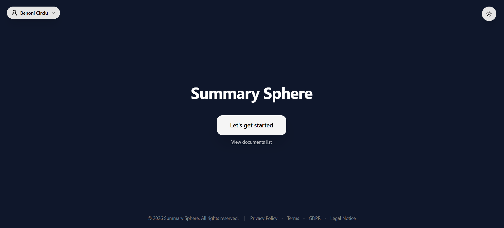
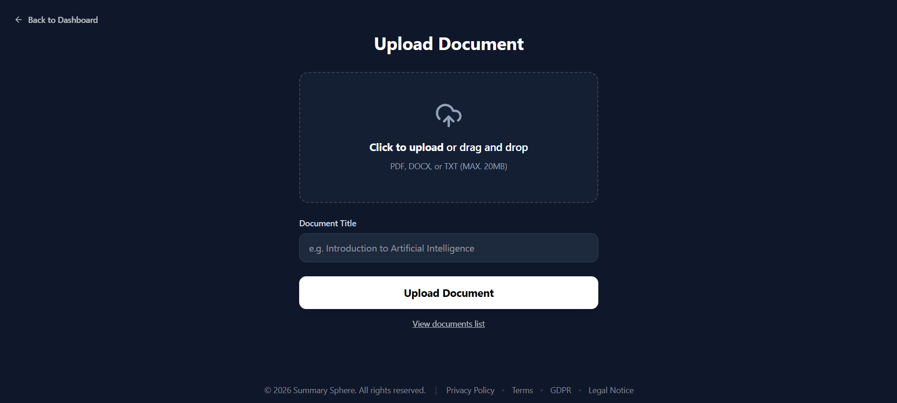
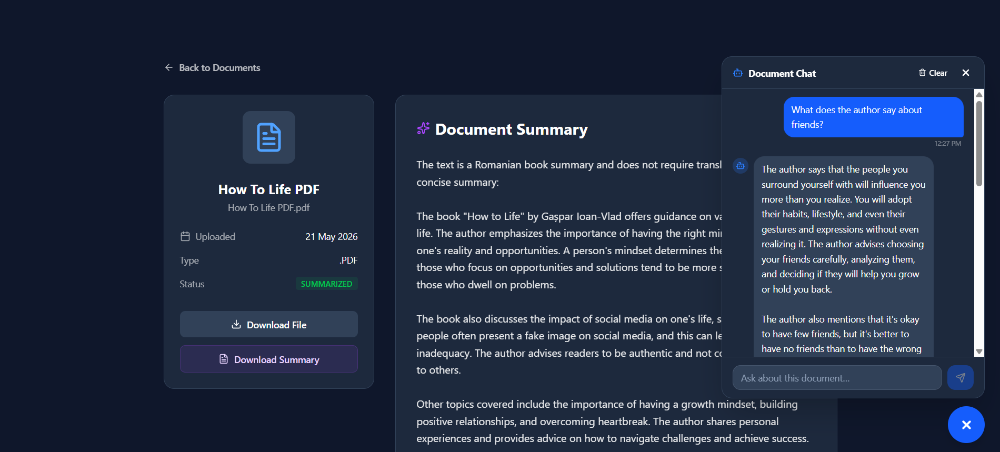
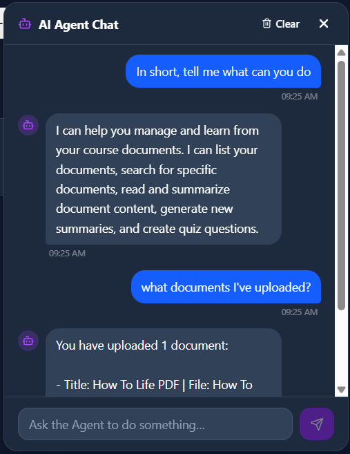

# SummarySphere (AI Course Summarizer - Backend)

A Spring Boot-based microservice for AI-powered course summarization. It allows students to upload documents (PDF, Word, or Text), parses their content using Apache Tika, persists them in Azure Blob Storage, and generates summaries using Google's Gemini AI via Spring AI.

The application also features an interactive document-specific chat (Retrieval-Augmented Generation / RAG) utilizing pgvector as a vector store, as well as a general AI chat assistant.

---

## 📸 Screenshots


*Landing page of the application.*


*Personal dashboard for uploading, managing, and summarizing documents.*


*Document upload interface.*


*Interactive chat session focusing on a specific document using RAG.*


*General AI assistant chat for study-related queries.*

---

## ✨ Key Features

* **File Parsing & Content Extraction:** Extracts text from PDF, Word (DOCX), and Text (TXT) files automatically using **Apache Tika**.
* **Dual AI Storage & Processing:**
  * Original documents and generated summary text files are securely persisted in **Azure Blob Storage**.
  * Documents are split, vectorized, and stored in a **PostgreSQL** database using the **pgvector** extension.
* **AI Summarization:** Supports customizable summarization types leveraging Spring AI to prompt the Gemini model.
* **Document Chat (RAG):** Allows students to have interactive, contextual conversations with a specific document using semantic search (cosine distance) on pgvector.
* **General AI Assistant:** Chat with a general conversational assistant for other study-related queries.
* **JWT Authentication:** Secure stateless session management and role-based route protection.
* **Password Reset & Verification:** Secure password recovery flows with tokens sent via **Gmail SMTP** or **Resend API**.
* **Auto-Schema Initialization:** Seamlessly initializes vector store schemas and database tables on startup.
* **Account Clean-Up:** Supports clean deletion of user accounts, which automatically purges all their files from Azure Blob Storage and clean-cascades database records.

---

## 🛠️ Tech Stack

**Core Technologies:**
* **Language:** Java 21
* **Framework:** Spring Boot 4.0.0
* **AI Framework:** Spring AI (OpenAI for OpenRouter model calls, Google GenAI for Embeddings)
* **Vector Store:** pgvector (PostgreSQL Vector Extension)
* **Database:** PostgreSQL (with Hibernate JPA)
* **Cloud Storage:** Azure Blob Storage (Azure SDK)
* **Text Extraction:** Apache Tika (tika-core, tika-parsers-standard)
* **Authentication:** Spring Security & JJWT (JSON Web Token)
* **Email & Notifications:** Spring Boot Starter Mail & Resend Java SDK
* **API Documentation:** SpringDoc OpenAPI (Swagger UI)

---

## 🚀 Getting Started

If you want to run this backend project locally, follow these steps:

### Prerequisites
* Java 21 installed
* Maven installed
* Docker and Docker Compose installed
* A Google Gemini API Key
* A OpenRouter API Key (or OpenAI key)
* Azure Storage Account (or local emulator)

### 1. Clone the repository
```bash
git clone https://github.com/BCBeno/SummarySphere-BackEnd.git
cd SummarySphere-BackEnd
```

### 2. Environment Variables
To supply configuration to Spring Boot, create a `.env` file in the root directory:
```env
PORT=8080
DB_URL=jdbc:postgresql://localhost:5432/postgres
DB_USERNAME=postgres
DB_PASSWORD=postgres
JWT_SECRET=your_jwt_secret_key_should_be_long_and_secure
GOOGLE_API_KEY=your_google_gemini_api_key
OPENROUTER_API_KEY=your_openrouter_api_key
OPENROUTER_BASE_URL=https://openrouter.ai/api/v1
OPENROUTER_CHAT_MODEL=google/gemini-2.0-flash-exp:free
AZURE_STORAGE_CONNECTION_STRING=your_azure_storage_connection_string
AZURE_STORAGE_CONTAINER_NAME=your_azure_storage_container_name
MAIL_EMAIL=your_gmail_address@gmail.com
MAIL_PASS=your_gmail_app_password
RESEND_API_KEY=your_resend_api_key
```

### 3. Start Database and Azurite (Docker)
Run the docker compose file in the root folder to start PostgreSQL (with pgvector) and Azurite (Azure Storage Emulator):
```bash
docker compose up -d
```

### 4. Run the Backend
Build the project and run the Spring Boot application:
```bash
mvn clean install
mvn spring-boot:run
```
The application will run on port `8080`.

---

## 📖 API Endpoints & Swagger Documentation

Once the backend is running, the interactive Swagger UI is available at:
`http://localhost:8080/swagger-ui/index.html`

### Primary Endpoints
* **Authentication (`/api/auth/**`):**
  * `POST /api/auth/register` - User registration
  * `POST /api/auth/login` - User login (returns JWT token)
  * `POST /api/auth/forgot-password` - Request a password reset link (asynchronous email)
  * `POST /api/auth/reset-password` - Reset password with token
* **Documents (`/api/documents/**`):**
  * `POST /api/documents` - Upload document (PDF, Word, Text)
  * `GET /api/documents/{id}` - Retrieve document metadata
  * `DELETE /api/documents/{id}` - Delete a document
  * `GET /api/documents/{id}/download-link` - Generate secure download URL
  * `POST /api/documents/{id}/summarize` - Request AI summary
  * `GET /api/documents/{id}/summary` - Get latest summary
  * `GET /api/documents/{id}/summaries` - List all summaries
* **RAG Document Chat (`/api/documents/{id}/chat/**`):**
  * `POST /api/documents/{id}/chat` - Send question about a document
  * `GET /api/documents/{id}/chat` - Get chat history
  * `DELETE /api/documents/{id}/chat` - Clear chat history
* **Agent Chat (`/api/agent/chat/**`):**
  * `GET /api/agent/chat` - Retrieve conversational agent chat
  * `POST /api/agent/chat` - Send general study questions
  * `DELETE /api/agent/chat` - Reset conversational chat
* **Users (`/api/users/**`):**
  * `GET /api/users/me/documents` - List documents uploaded by current user
  * `DELETE /api/users/me` - Delete user account and delete all associated files in Azure and database records

---

## 👥 Maintained & Developed By

You're currently looking at the front-end code. Click [here](https://github.com/BCBeno/SummarySphere-BackEnd) to see the back-end repository.

The repository is maintained and developed by:

<p align="left">
  <a href="https://github.com/BCBeno">
    
  </a>
  &nbsp;&nbsp;&nbsp;&nbsp;
  <a href="https://github.com/Rbt-Ghost">
    
  </a>
</p>

---

## 🤝 Acknowledgments

<p align="center">
  
  &nbsp;&nbsp;&nbsp;&nbsp;&nbsp;&nbsp;&nbsp;&nbsp;&nbsp;&nbsp;
  
</p>

This project was developed as part of the **DUAL-USV** educational program. The practical implementation and full-stack development phases were carried out under the guidance and framework of the **ASSIST Academy**.

---

## 📜 License

This project is licensed under the MIT License - see the LICENSE file for details.
